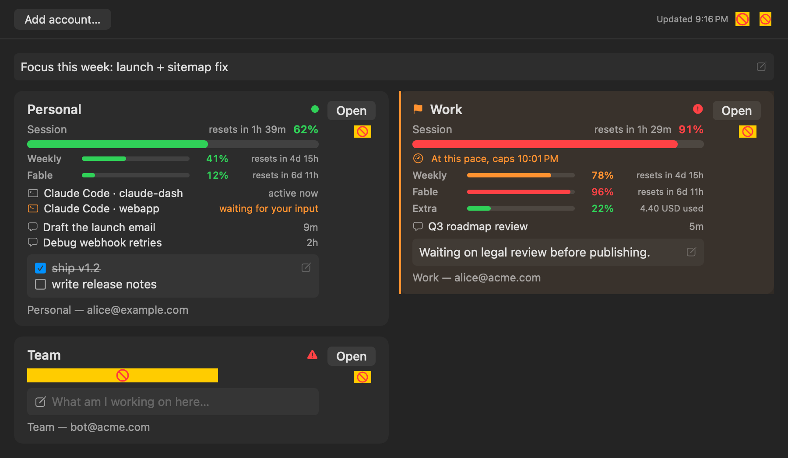
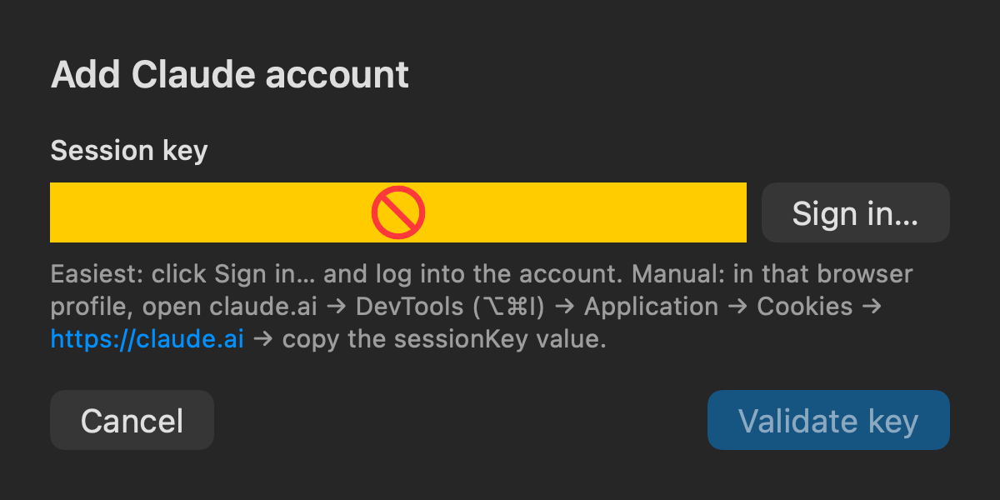
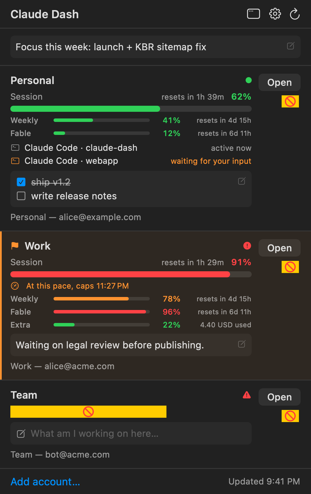

# Claude Dash


One menu-bar app for juggling multiple Claude accounts: every account's usage
at a glance, one click to open claude.ai in the right browser profile.



- **Menu-bar gauges** — a mini usage bar per account, always visible
  (or tightest-account-only / icon-only, your pick).
- **Floating dashboard** — every account with its **5-hour session** bar
  (+ reset countdown), **weekly** limit, **per-model weekly caps** (e.g.
  Fable), and **extra-usage credits** when enabled — each with its own reset
  time. **Open** launches claude.ai in that account's browser profile.
- **Burn-rate warning** — "at this pace, caps 12:09 PM" when your current
  session pace would hit the limit before the reset.
- **Board window** — a real, standalone macOS window (⌃⌥⌘D, or the window
  button in the popover): accounts as side-by-side cards, **larger text**
  (independent 90–160% zoom in Preferences), per-account **notes** (`- [ ] task`
  lines become checkboxes; click away, press Esc, or ⌘⏎ to finish and save),
  a global scratchpad, and a manual **attention flag** per account that also
  lights a dot in the menu bar. Resizable, remembers its frame, optional
  always-on-top, reopens at launch if you had it open. Standard shortcuts work
  (⌘R refresh, ⌘N add account, ⌘B board, ⌘, settings, ⌘C/⌘V in fields).
- **Dashboard zoom** — Quick Glance and Board each remember their own text and
  layout size. With either dashboard focused, use **⌘+**, **⌘−**, or **⌘0**;
  **⌥+** and **⌥−** are also available when you are not editing a note.
- **Signals** — each account shows its **recent claude.ai conversations**
  (last 48 hours only — no stale noise; click one to open it in the right
  profile). Opt into the bundled Claude Code hooks (Preferences → Install)
  and a **Claude Code** section shows your local sessions, including
  *"waiting for your input."* Notes and signals are all local files; nothing
  leaves your Mac.
- **In-app sign-in** — adding an account opens a claude.ai login window and
  captures the session key automatically; no DevTools digging. (Manual
  cookie-paste still works.)
- **Same email, multiple workspaces?** Fine — usage is tracked per
  *organization*; pick the org when adding the account.
- **Notifications** — configurable threshold alert, plus a "session reset —
  good to go" ping for capped accounts.
- **One-click updates** — signed release builds can use **Check for Updates…
  → Install and Relaunch**. Source builds and older releases retain the
  GitHub-release/manual-upgrade path until the signed updater is configured.
- Keys live in the **macOS Keychain**, never on disk. Works with **Chrome,
  Brave, Edge, or Chromium** profiles. Global hotkey **⌃⌥⌘D**. Universal
  binary (Apple Silicon + Intel).

## Install

Requires macOS 13+ and the Xcode Command Line Tools
(`xcode-select --install` — one-time, no full Xcode needed).

```bash
git clone https://github.com/brianyoungilcho/claude-dash.git && cd claude-dash && ./install.sh
```

Or via Homebrew (`--no-quarantine` because the app isn't notarized):

```bash
brew install --cask --no-quarantine brianyoungilcho/tap/claude-dash
```

That's it: builds a universal binary into `/Applications/Claude Dash.app`,
launches it, and registers it to start at login (once — disable it in
System Settings or Preferences and your choice sticks). Local builds have no
Gatekeeper friction. Source checkouts can always upgrade with
`git pull && ./install.sh`. On a signed-updater build, right-click the
menu-bar icon → **Check for Updates…** → **Install and Relaunch** instead.
The first signed-updater release still needs one manual install; older releases
do not gain an updater retroactively.

> **Prebuilt zip from [Releases](https://github.com/brianyoungilcho/claude-dash/releases)
> instead?** The app is ad-hoc signed, not notarized, so "right-click → Open"
> does NOT work on current macOS. Instead: unzip, **drag `Claude Dash.app`
> into `/Applications`** (required — running from Downloads breaks
> start-at-login via App Translocation), then clear quarantine:
> `xattr -dr com.apple.quarantine "/Applications/Claude Dash.app"` and open it.

### Not comfortable with the terminal? Install with an AI assistant

If you use an AI agent that can run commands on your Mac (Claude Code, Claude
Desktop with computer access, Codex, etc.), just paste this prompt and it will
handle everything:

```text
Install Claude Dash (a free, open-source macOS menu-bar app that shows Claude
usage limits across multiple accounts) from
https://github.com/brianyoungilcho/claude-dash on this Mac.

1. Read https://raw.githubusercontent.com/brianyoungilcho/claude-dash/main/AGENTS.md
   and follow its install section.
2. Check for Xcode Command Line Tools first (xcode-select -p). If they're
   missing, run xcode-select --install, warn me that a macOS dialog will pop
   up, and wait until I tell you it has finished.
3. Clone the repository and run ./install.sh from its root.
4. Verify success: a small gauge icon appears in the menu bar at the top-right
   of my screen. Then walk me through adding my first Claude account
   (right-click the icon → Add Account…).

Explain each step before you run it. If you can't run commands on my computer,
give me the exact Terminal commands to type, one at a time. Talk to me in the
language I normally write in.
```

## Add an account



1. Menu-bar gauge icon → right-click → **Add Account…** (or the dashboard's
   "Add account…" button).
2. Click **Sign in…** and log into the Claude account — the session key is
   captured automatically and validated. (Manual fallback: copy the
   `sessionKey` cookie from DevTools in that browser profile.)
3. Pick the **organization** (chat orgs listed first; API-console orgs are
   labeled and can't serve usage) and the **browser profile** it should open
   with. Usage is verified live before saving, so a wrong pick fails loudly
   here, not silently later.

Session keys rotate periodically. When one dies, the row turns red — **⋯ →
Edit… → Sign in…** gets a fresh one in seconds.

The menu-bar popover stays as the compact quick glance:



## Preferences

Gear icon in the dashboard (or right-click → Settings…, ⌘,): refresh interval,
account sort order (added / most headroom / most used), menu-bar display mode,
used-vs-remaining labels, notification threshold + reset alerts,
launch-at-login, hotkey, board float behavior, separate Quick Glance and Board
zoom levels, the
conversations toggle, and the optional Claude Code hooks (installed by
merging into `~/.claude/settings.json` with a backup; removable from the
same place — the Claude Code section only exists while hooks are installed).

Notes are stored in
`~/Library/Application Support/Claude Dash/notes.json` — plain JSON, local
only, trivially backed up or synced with your own tooling.

Power-user overrides via `defaults` (browser selection):

```bash
defaults write com.claudedash.app browserAppName "Brave Browser"
defaults write com.claudedash.app browserSupportSubpath "BraveSoftware/Brave-Browser"
```

## How it works

Usage comes from claude.ai's internal
`GET /api/organizations/{orgUuid}/usage` — the same endpoint the claude.ai
usage page reads — authenticated by the session-key cookie. It returns
percentages, not token counts. The parser prefers the modern `limits[]` array
(session / weekly_all / per-model weekly_scoped) with legacy-field fallback,
so new model caps appear automatically.

**Disclaimer:** unofficial, community-built, not affiliated with Anthropic.
The endpoint is internal and can change without notice — if every account
errors at once, check for a newer release. Session keys grant full account
access: they're stored only in your local Keychain and sent only to claude.ai.
Use at your own risk.

More: [FAQ](FAQ.md) · [Uninstall](#uninstall) · [Development](#development)
· [Signed updater setup](docs/UPDATER.md)

## Uninstall

```bash
osascript -e 'quit app "Claude Dash"'
rm -rf "/Applications/Claude Dash.app"
defaults delete com.claudedash.app
security delete-generic-password -s com.claudedash.sessionkey || true  # repeat until "not found"
```

Then remove the stale "Claude Dash" entry under **System Settings → General →
Login Items**, if one remains.

## Development

| Path | Contents |
|------|----------|
| `Sources/Core.swift` | Models, Keychain (via `security` CLI), browser/profile discovery, `UsageAPI` |
| `Sources/AppModel.swift` | Observable state, polling, pace projection, notifications |
| `Sources/Views.swift` | SwiftUI: dashboard, metric rows, add/edit sheets, preferences |
| `Sources/Prefs.swift` | Typed UserDefaults settings |
| `Sources/WebSignIn.swift` | In-app claude.ai login window (isolated cookie store) |
| `Sources/Board.swift` | Standalone board window: adaptive card grid at the user's zoom level |
| `Sources/Updater.swift` | Sparkle standard updater bridge plus safe GitHub-release fallback |
| `Sources/main.swift` | App bootstrap, floating panel, menu bar, hotkey, update check |
| `build.sh` | Universal build, verified Sparkle embedding, nested signing, and bundle assembly |
| `Scripts/bootstrap-sparkle.sh` | SHA-256-verified pinned Sparkle bootstrap |
| `docs/UPDATER.md` | Key, appcast, GitHub Pages, and release-owner instructions |
| `Tests/main.swift` | Headless tests (CI-safe; live-endpoint check runs locally) |
| `Preview/main.swift` | Renders the views to PNG for design review |

```bash
# run tests
./Scripts/test.sh

# build to /Applications (downloads the pinned Sparkle framework if needed)
./build.sh

# render the views to PNGs (Preview has its own main.swift, so exclude Sources/main.swift)
swiftc -swift-version 5 -o .build/preview Preview/main.swift \
  Sources/Core.swift Sources/AppModel.swift Sources/Views.swift \
  Sources/Prefs.swift Sources/WebSignIn.swift Sources/Notes.swift Sources/ClaudeCode.swift Sources/Codex.swift Sources/Board.swift \
  -framework AppKit -framework SwiftUI -framework WebKit -framework UserNotifications
OUT=/tmp ./.build/preview
```

CI builds and verifies the embedded universal framework plus the test suite on
every push. Tagging `v*` runs those checks before creating a draft release;
when the signed-updater keys are configured, it signs and deploys the appcast
before publishing that release. See [the updater guide](docs/UPDATER.md).

**Roadmap / non-goals:** configurable hotkey is planned.
Out of scope by design: local JSONL cost analytics (use
[ccusage](https://github.com/ryoppippi/ccusage)), multi-provider quota
tracking, Claude Code credential rotation.

## Credits

Created and maintained by [Brian Cho](https://github.com/brianyoungilcho).
To cite this project, use GitHub's **"Cite this repository"** button (backed
by [CITATION.cff](CITATION.cff)) — and if it saved you a rate-limit headache,
a ⭐ helps others find it.

- The claude.ai usage-endpoint approach was informed by
  [Claude Usage Tracker](https://github.com/hamed-elfayome/Claude-Usage-Tracker)
  by [@hamed-elfayome](https://github.com/hamed-elfayome) (MIT) — its recipe
  was studied and reimplemented from scratch here; no code was copied.
- Built with [Claude Code](https://claude.com/claude-code) (Anthropic).
- Not affiliated with or endorsed by Anthropic.

MIT licensed.
